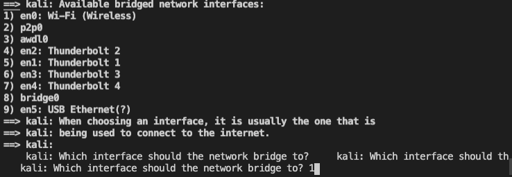

# Virtual Machine Setup
This section will help you to create your kali VM that you can use to reproduce the topics covered during the presentation via [Vagrant](https://www.vagrantup.com/) and [VirtualBox](https://www.virtualbox.org/). 

If you want to use Windows, all of the products appear to be supported, but we're not going to cover that here. Good luck!

1. Install dependencies
   * Vagrant: https://www.vagrantup.com/downloads
   * VirtualBox: https://www.virtualbox.org/wiki/Downloads
   * Vagrant Guest Additions Plugin: https://github.com/dotless-de/vagrant-vbguest

2. Get your active network interface by running this script on Linux or Mac OS
   ```
   ifconfig | awk '/UP/{print $1}' | grep 'eth0:\|en0:'
   ```
   **Explanation of this command:**
   * `ifconfig` - used to get network interface configuration
   * `awk '/UP/{print $1}'` - match all of the lines from the output of the previous command that have `UP` in them and print the first column of each match
   * `grep 'eth0:\|en0:'` - match all of the lines from the output of the previous command only with `eth0` OR `en0` in them

   Alternatively, there are plenty of articles on the internet that will show you how to do this through the GUI.

3. Start the VM
    ```
    vagrant up
    # Wait for a bit... Probably 5-10 minutes. It will get faster after you've downloaded the base box the first time. 
    ```
    Find the number that corresponds to the output from Step 2 when you see this prompt:

      
    and then hit the Enter key.

    For example, if your active interface is `en0`, which corresponds to `1)`:

    

4. Login to the VM 
   Once you see this prompt:
   

   You will need to login to the system. The credentials are:
   * Username: `vagrant`
   * Password: `vagrant`

At this point, you should feel free to move on to [Virtual Machine Setup](1_vm_setup.md).