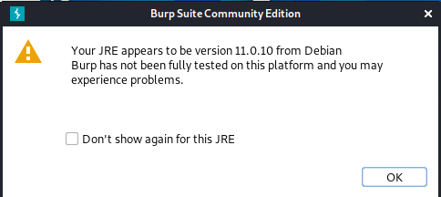
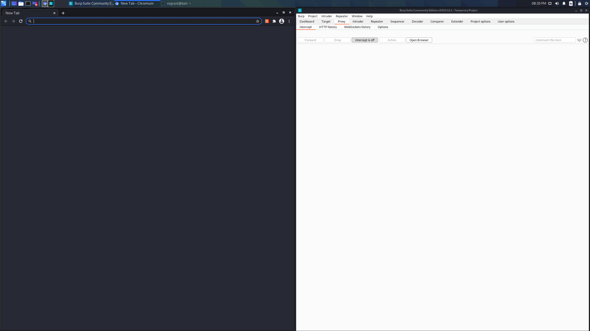
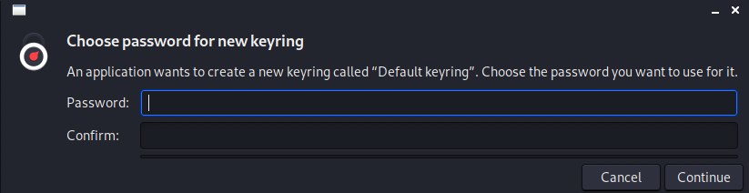

# Virtual Machine Setup
This section will help you to configure your kali VM that you can use to reproduce the topics covered during the presentation.

1. Fullscreen your VM
   * On Mac OS, you can use Command-F
   * On Linux, you can use Right Ctrl-F

2. Change the default password

   As you're probably aware, `vagrant/vagrant` is not the most secure password combination out there. Let's fix that real quick. Open a terminal by clicking this icon in the upper left-hand corner of the screen:

   

   Next, run this command:
   ```
   sudo passwd vagrant
   ```

   When prompted, enter whatever password you desire. The next time you log in, this will be the password that you use for the vagrant user.

3. Install Docker

   Docker is used to run containers. Containers are used to package applications and be able to run them anywhere. There's plenty more information on the internet that I encourage you to read. Run these commands to install Docker:
   ```
   wget https://raw.githubusercontent.com/l50/unm_ismart_presentation/main/scripts/kali_docker.sh
   bash kali_docker.sh
   ```

   Finish up the install by rebooting your VM:
   ```
   sudo reboot
   ```

4. Start Burp

   Burp Suite is a proxy that you can use to intercept web traffic. It is immensely helpful when it comes to web application security, and I'm of the opinion that most (if not all) security professionals should have some familiarity. To run it, type this command into a terminal window:
   ```
   burpsuite
   ```

   Check the box next to **Don't show again for this JRE** and click **OK** when you see this message:

   

   Click **I Agree** for the terms and conditions.

   If there's an update available, go ahead and click **Close**. At this point, you should be at this window:

   

   Go ahead and click **Next** and then **Start Burp**

   Burp should now be running. It'll probably look like this:
   
   

   Burp should be running. Go ahead and click on **Proxy** and then click **Intercept is on** to turn intercept mode off for now.

   Next, click **Open Browser**. Generally speaking, this is the window configuration I like to have when I'm working with Burp:

   

   Please feel free to click **Cancel** if you see a pop up like this one:

   

At this point, you should feel free to move on to [Web Basics](2_web_basics.md).


# References

* Install docker manually [Docker Docs](https://docs.docker.com/engine/install/ubuntu/)
* What is Burp [Burp Pages](https://portswigger.net/burp)
* Open Source alternative to Burp [OWASP Zap](https://owasp.org/www-project-zap/)
<br/><br/>
[](https://youtu.be/T47SIBZSVOo)
<br/><br/>
[](https://youtu.be/eGz9DS-aIeY)
<br/><br/>
[](https://youtu.be/3K1-a7dnA60)
